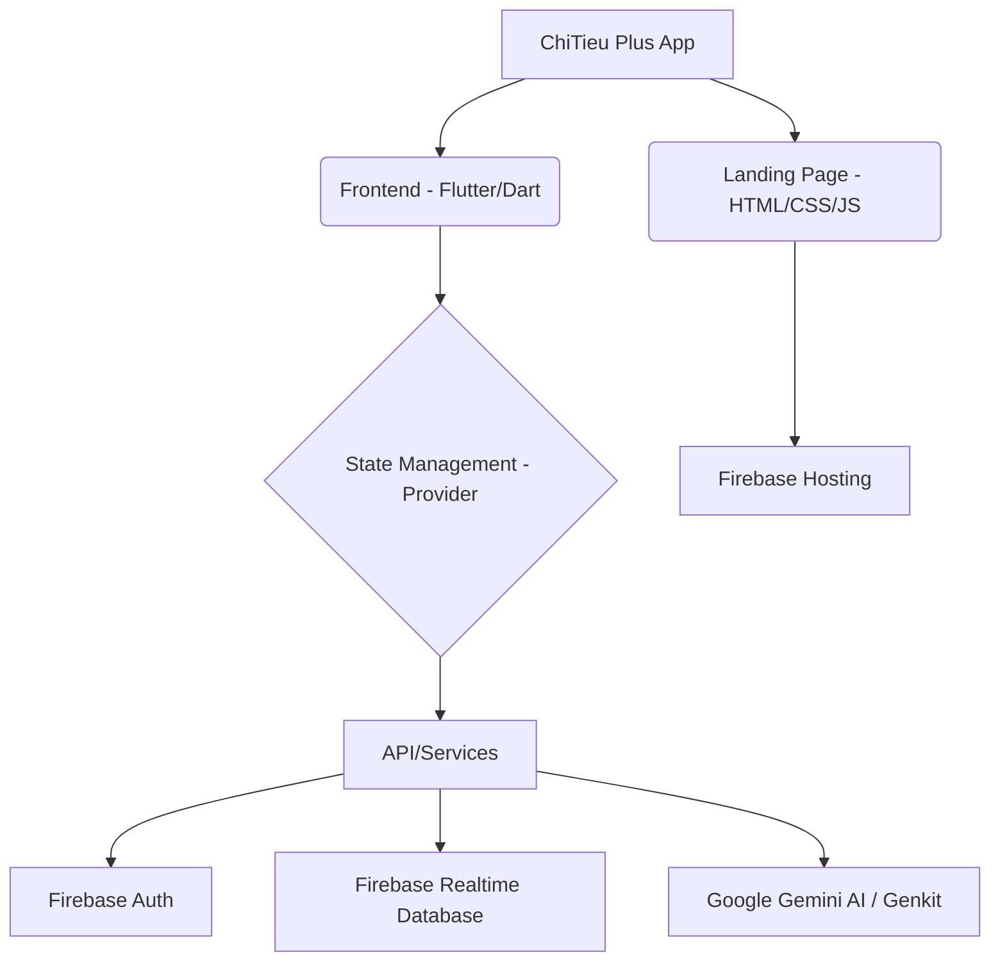

# 💰 ChiTieu Plus - Quản lý tài chính cá nhân thông minh


**ChiTieu Plus** là một ứng dụng di động mạnh mẽ và tinh tế được xây dựng bằng **Flutter**, giúp người dùng theo dõi chi phí, quản lý ngân sách và phân tích thói quen tài chính một cách khoa học. 

Được thiết kế cho mọi người Việt, ChiTieu Plus kết hợp giữa sự đơn giản trong nhập liệu và sự tinh tế trong báo cáo đồ họa, cùng sự hỗ trợ thông minh từ AI.

---

## 🌟 Tính năng chính

### 📱 Ứng dụng di động
- **Ghi chép giao dịch nhanh:** Nhập liệu chi tiết các khoản thu/chi chỉ trong vài giây với các danh mục mẫu có sẵn.
- **Phân loại thông minh:** Tự động phân loại chi phí theo nhóm (Ăn uống, Di chuyển, Mua sắm, v.v.).
- **Báo cáo trực quan (Smart Reports):** Hệ thống biểu đồ (Pie/Bar/Line chart) hiển thị dòng tiền theo ngày, tuần, tháng.
- **Trợ lý AI hỗ trợ:** Phân tích dữ liệu chi tiêu và đưa ra lời khuyên tiết kiệm tài chính (Sử dụng Google Gemini).
- **Đồng bộ hóa đám mây:** Dữ liệu được lưu trữ và đồng bộ hóa tức thì trên **Firebase**.
- **Chế độ Sáng/Tối:** Giao diện cao cấp phối hợp hoàn hảo với hệ thống hệ điều hành.

### 🌐 Trang web giới thiệu (Landing Page)
- Giới thiệu sản phẩm và tính năng cốt lõi.
- Cung cấp liên kết tải xuống thích hợp cho từng hệ điều hành.
- Hiển thị yêu cầu hệ thống chi tiết.
- Hỗ trợ thay đổi theme (Light/Dark mode).

---

## 🏗️ Cấu trúc hệ thống

Dự án được xây dựng trên kiến trúc **Clean Architecture** kết hợp với **Provider** để quản lý trạng thái:



### 📂 Chi tiết cấu trúc thư mục `lib/` (System Architecture)

Toàn bộ logic cốt lõi của ứng dụng được tổ chức trong thư mục `lib/` theo mô hình quản lý trạng thái tập trung:

- **`models/`**: Chứa các lớp định nghĩa đối tượng dữ liệu (Transaction, User, Category...). Đây là tầng dữ liệu gốc của hệ thống.
- **`providers/`**: Tầng xử lý logic nghiệp vụ và quản lý trạng thái (State Management). Sử dụng `ChangeNotifier` để thông báo thay đổi dữ liệu tới giao diện.
- **`screens/`**: Chứa các trang giao diện chính (Home, Statistics, Add Transaction, Settings...). Mỗi file đại diện cho một màn hình hoàn chỉnh.
- **`services/`**: Các dịch vụ kết nối bên ngoài như Firebase Service, AI Service (Gemini), Local Auth. Giúp tách biệt logic kết nối khỏi UI.
- **`widgets/`**: Các thành phần giao diện dùng chung (Custom Buttons, Cards, Dialogs...) giúp tái sử dụng mã nguồn và giữ code sạch sẽ.
- **`utils/`**: Chứa các hàm tiện ích như định dạng tiền tệ (Currency formatter), hằng số màu sắc, cấu hình font chữ.
- **`main.dart`**: Điểm khởi đầu của ứng dụng, nơi cấu hình các Provider và khởi tạo Firebase.
- **`firebase_options.dart`**: Cấu hình kết nối riêng biệt cho từng nền tảng (Android/iOS/Web).

---

## 🛠️ Công nghệ sử dụng

- **Mobile:** Flutter (Dart)
- **Backend:** Firebase (Authentication, Realtime Database, Cloud Messaging)
- **AI Engine:** Google Gemini (thông qua Genkit/Firebase AI Logic)
- **Web Hosting:** Firebase Hosting
- **Icons:** Lucide Icons & FontAwesome
- **Typography:** Outfit & Inter (Google Fonts)

---

## 💻 Hướng dẫn tải xuống & Cài đặt

Bạn có thể tải phiên bản mới nhất tại:
- **Windows (EXE):** [GitHub Releases](https://github.com/phoductien/CHITIEU_PLUS/releases)
- **Android (APK):** [MediaFire Download](https://www.mediafire.com/folder/chitieuplus)
- **iOS (IPA):** Đang cập nhật trên App Store.

### 🚀 Dành cho nhà phát triển (Development)

1. **Clone project:**
   ```bash
   git clone https://github.com/phoductien/CHITIEU_PLUS.git
   cd CHITIEU_PLUS
   ```

2. **Cài đặt dependencies:**
   ```bash
   flutter pub get
   ```

3. **Chạy ứng dụng:**
   ```bash
   flutter run
   ```

4. **Chạy Landing Page (Local Emulator):**
   ```bash
   firebase emulators:start --only hosting
   ```

---

## 📢 Liên hệ & Đóng góp
Nếu bạn có bất kỳ câu hỏi hoặc ý tưởng đóng góp nào, vui lòng mở một **Issue** hoặc **Pull Request** trên GitHub.

*Cảm ơn bạn đã quan tâm đến ChiTieu Plus!*
